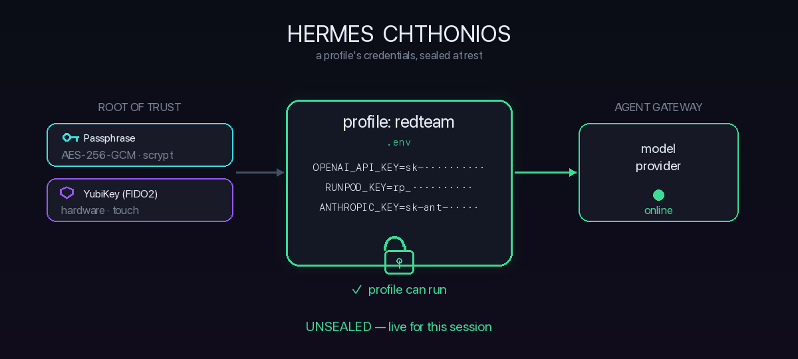
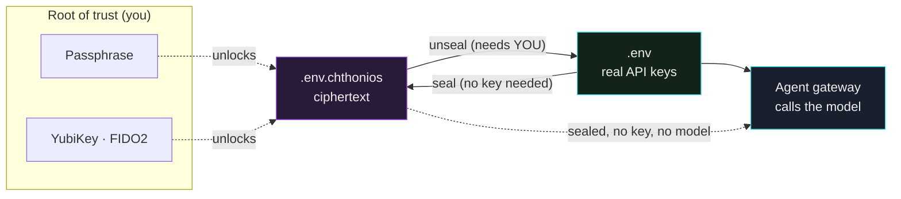

<div align="center">


# Hermes Chthonios

**Seal a Hermes agent profile at rest.** While a profile is sealed it cannot read a single API key, so it cannot call any model, until you unlock it.

[](https://github.com/iacker/hermes-chthonios/actions/workflows/ci.yml)
[](LICENSE)
[](https://www.python.org/)
[](pyproject.toml)
[](#requirements)

</div>

<div align="center">



<em>Sealing needs no key, so an agent can lock itself. Unsealing needs you: a passphrase, or a YubiKey physically present and touched.</em>

</div>

## The idea in one breath

A Hermes secret manager decides **where** a profile's credentials live. Chthonios decides **when** a profile is allowed to hold them at all.

Every Hermes profile keeps its credentials in a `.env` file. Chthonios encrypts that file into ciphertext. A sealed profile's gateway starts, finds no API key, and cannot answer with any model until a human unlocks it. A UI passcode only stops someone glancing at your screen and is bypassable from a shell, because the plaintext is still there. Chthonios removes the plaintext. There is nothing to bypass.

The property that makes it interesting:

> **Can an autonomous agent revoke its own access to its credentials, without keeping the means to undo that decision?**

With the hardware lock, yes. Sealing needs only a public recipient, so an unattended agent can seal itself. Unsealing needs the physical key in someone's hand. The agent puts itself in a state it has no cryptographic means to reverse.

## Why you'd want it

| Without Chthonios | With Chthonios |
|---|---|
| API keys sit in plaintext `.env` files | Keys are ciphertext at rest |
| Stolen laptop means stolen keys | Stolen laptop means useless ciphertext |
| A screen lock is bypassable from a shell | Nothing to bypass, the secret is gone until unlocked |
| Any process can read the profile's secrets | A human decision (passphrase or touch) is required |
| An automated agent holds its own keys forever | An agent can seal itself and be unable to reopen without you |

## How it works



* **Seal.** The plaintext `.env` is encrypted into `.env.chthonios` and shredded. No passphrase or key is needed to seal, so automation can lock a profile it must never be able to reopen on its own.
* **Sealed.** The gateway finds no key. The profile is inert. That is the guarantee.
* **Unseal.** You provide the root of trust. In passphrase mode, your passphrase. In hardware mode, the YubiKey must be plugged in and physically touched. The `.env` is recreated (mode `600`) for the session.
* **Lock.** Drop the plaintext again, keep the seal. Re-locking is instant.

## Two locks, independent

| Lock | Root of trust | Mechanism |
|---|---|---|
| **Passphrase** | Something you know | `.env` sealed with AES-256-GCM, key derived by scrypt (N=2²⁰, about 1s per derivation). |
| **YubiKey / FIDO2** | Something you hold | `.env` sealed with `age` and the FIDO2 `hmac-secret` extension. Decryption requires the enrolled hardware key present and touched. Lose the key and the profile stays inert. |

## Quickstart

### Install

```bash
pip install -e .          # provides the `chthonios` CLI
```

Optional desktop lock UI:

```bash
mkdir -p ~/.hermes/desktop-plugins/chthonios
cp desktop-plugin/plugin.js ~/.hermes/desktop-plugins/chthonios/plugin.js
# then ⌘K → "Reload desktop plugins" in Hermes Desktop
```

### Mode A, passphrase (works everywhere)

```bash
chthonios seal   redteam           # encrypt .env
chthonios status                   # table of every profile
chthonios unseal redteam           # decrypt for a session
chthonios lock   redteam           # drop plaintext, keep the seal
chthonios rekey  redteam           # change the passphrase
```

### Mode B, YubiKey (hardware-gated, strongest)

```bash
# 1. Bind your YubiKey, interactive, run in YOUR terminal (needs a touch):
chthonios enroll-key redteam       # prints the exact command to run

# 2. Seal to the key, no touch needed (encryption only):
chthonios seal redteam --fido2

# 3. Unseal later, REQUIRES the YubiKey plugged in and a touch:
chthonios unseal redteam
```

Nothing decrypts a hardware-sealed profile without the physical key in hand: not the agent, not a thief with your Mac, not a cloned disk.

## Auditing what is sealed

`chthonios status` reports every profile at a glance: which are managed, sealed, currently unlocked, with which backend, whether the seal is structurally intact, and when it was sealed.

```
PROFILE          MANAGED  SEALED  UNLOCKED  BACKEND    INTEGRITY  SEALED_AT
redteam          True     True    False     passphrase ok         2026-08-22T21:47:38
default          False    False   True
```

`chthonios verify` goes further and validates each seal's structure without any key or passphrase. It confirms a passphrase seal is a well-formed envelope (known version, valid salt/nonce/ciphertext) and a hardware seal is a valid `age` ciphertext. This catches a corrupted or truncated-to-garbage seal before you rely on it.

```bash
chthonios verify           # all profiles, non-zero exit if any seal is broken
chthonios verify redteam   # one profile
```

```
[OK ] redteam          ok  (passphrase · 255B · 2026-08-22T21:47:38)
```

What `verify` does not do: it cannot prove the passphrase or run the AES-GCM authentication tag, because both need the key. Only `unseal` does that, and the authenticated cipher rejects any tampered ciphertext at that point. `verify` is a fast structural pre-check; `unseal` is the cryptographic proof.

## Is it easy to plug in?

Yes. Chthonios is additive and non-invasive:

* It only touches files inside a profile directory (`~/.hermes/profiles/<name>/`). It reads `.env`, writes `.env.chthonios`, and puts them back. Nothing in Hermes core changes.
* Uninstall means unseal everything and delete the package. Your profiles are plain `.env` files again.
* No secrets in the repo: `.env*`, `*.chthonios`, `*.identity`, and `*.recipient` are git-ignored.
* The desktop plugin is a single drop-in `plugin.js`. Skip it if you don't want UI; the CLI is the whole product.

## How it's built

Small, readable, dependency-light. The cryptography lives in one file with no Hermes imports, so you can audit or reuse it on its own.

| File | Responsibility |
|---|---|
| `chthonios/sealing.py` | AES-GCM and scrypt envelope; file seal/unseal, no Hermes deps |
| `chthonios/agefido.py` | `age` and FIDO2 `hmac-secret` key source (hardware-gated mode) |
| `chthonios/profiles.py` | Hermes profile path resolution and seal state |
| `chthonios/auth.py` | passphrase prompt, keychain helpers |
| `chthonios/cli.py` | the `chthonios` command |
| `desktop-plugin/plugin.js` | statusbar lock chip and commands (reads state only) |
| `tests/` | round-trip, wrong-passphrase, tamper detection, no-leak |

## Requirements

**Core (passphrase mode), macOS and Linux:**

* Python 3.9+
* [`cryptography`](https://pypi.org/project/cryptography/) 41 or newer (installed automatically)

**YubiKey / FIDO2 mode (optional, strongest):**

* [`age`](https://github.com/FiloSottile/age) 1.1+ (`brew install age`)
* [`age-plugin-fido2-hmac`](https://github.com/olastor/age-plugin-fido2-hmac)
* `libfido2`
* Any FIDO2 authenticator with the `hmac-secret` extension (tested on a YubiKey Security Key C NFC, firmware 5.4.3)

> **Back up your key.** A hardware seal has no backdoor. Lose the only enrolled key and the data is gone for good. Enroll a second YubiKey as a spare.

## Security model

* **Cipher:** AES-256-GCM, authenticated, so tampering is detected on unseal.
* **KDF:** scrypt, N=2²⁰, r=8, p=1, about 1s per derivation.
* **Root of trust:** the passphrase, or (hardware mode) the key's `hmac-secret`. The on-disk `.identity` file only wraps a credential to the token; it is useless without the physical key. The `.recipient` (an `age1…` public key) is not secret.
* **The renderer never decrypts.** The desktop plugin reads seal state only and shells you the CLI command; passphrases and plaintext never touch JS.
* **Shredding** of the plaintext `.env` is best-effort (overwrite then unlink). On SSD and copy-on-write filesystems this is not forensic-grade. The seal, not the shred, is the protection.

## License

MIT © iacker
