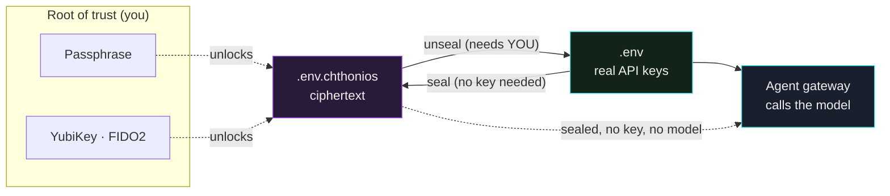
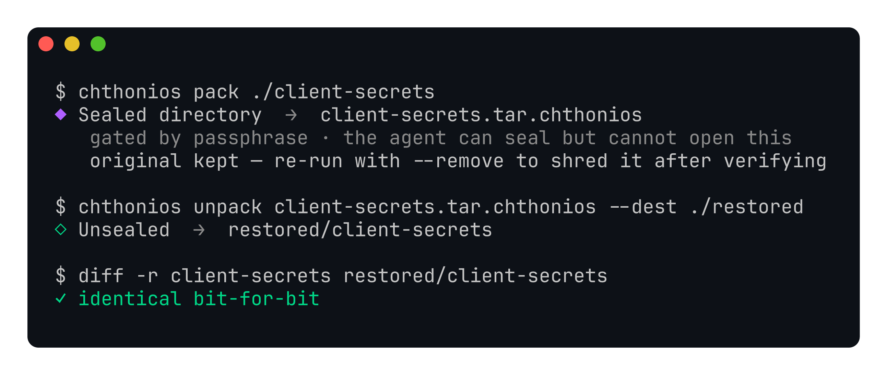
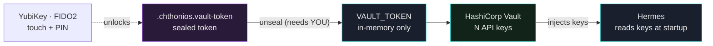
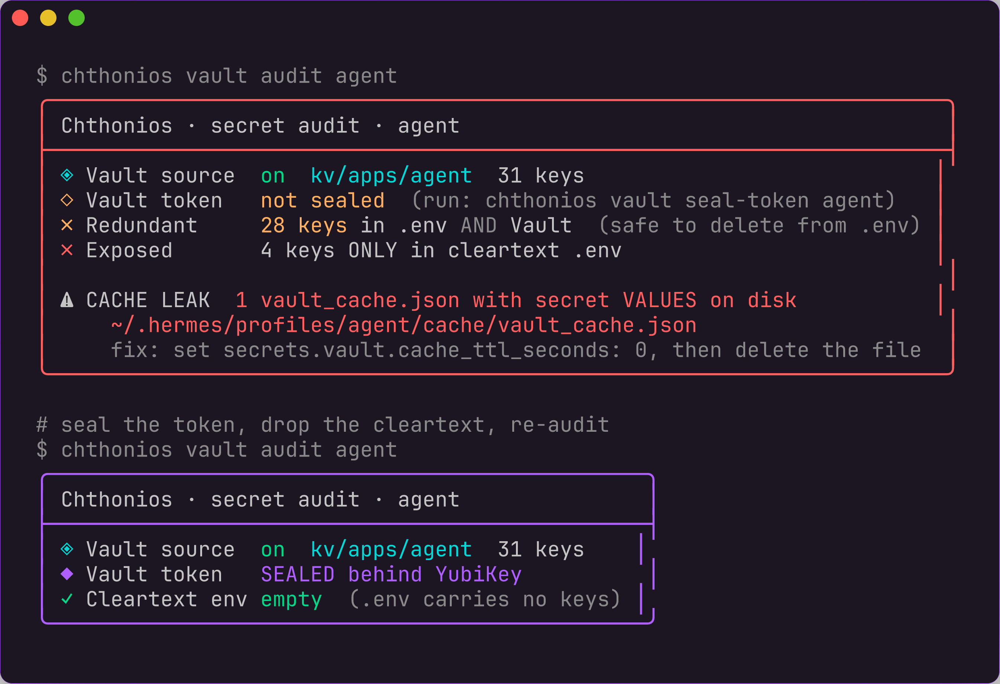
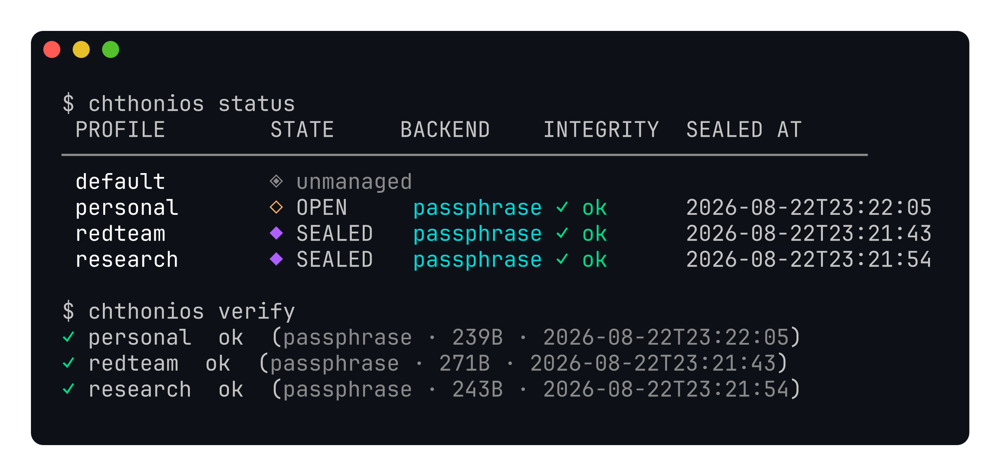

<div align="center">


# Hermes Chthonios

**Seal a Hermes agent profile at rest.** While a profile is sealed it cannot read a single API key, so it cannot call any model, until you unlock it.

[](https://github.com/iacker/hermes-chthonios/actions/workflows/ci.yml)
[](LICENSE)
[](https://www.python.org/)
[](pyproject.toml)
[](#requirements)

</div>

<div align="center">


<em>Sealing needs no key, so an agent can lock itself. Unsealing needs you: a passphrase, or a YubiKey physically present and touched.</em>

</div>

## The idea in one breath

A Hermes secret manager decides **where** a profile's credentials live. Chthonios decides **when** a profile is allowed to hold them at all.

Every Hermes profile keeps its credentials in a `.env` file. Chthonios encrypts that file into ciphertext. A sealed profile's gateway starts, finds no API key, and cannot answer with any model until a human unlocks it. A UI passcode only stops someone glancing at your screen and is bypassable from a shell, because the plaintext is still there. Chthonios removes the plaintext. There is nothing to bypass.

The property that makes it interesting:

> **Can an autonomous agent revoke its own access to its credentials, without keeping the means to undo that decision?**

With the hardware lock, yes. Sealing needs only a public recipient, so an unattended agent can seal itself. Unsealing needs the physical key in someone's hand. The agent puts itself in a state it has no cryptographic means to reverse.

## Why you'd want it

| Without Chthonios | With Chthonios |
|---|---|
| API keys sit in plaintext `.env` files | Keys are ciphertext at rest |
| Stolen laptop means stolen keys | Stolen laptop means useless ciphertext |
| A screen lock is bypassable from a shell | Nothing to bypass, the secret is gone until unlocked |
| Any process can read the profile's secrets | A human decision (passphrase or touch) is required |
| An automated agent holds its own keys forever | An agent can seal itself and be unable to reopen without you |

## How it works



* **Seal.** The plaintext `.env` is encrypted into `.env.chthonios` and shredded. No passphrase or key is needed to seal, so automation can lock a profile it must never be able to reopen on its own.
* **Sealed.** The gateway finds no key. The profile is inert. That is the guarantee.
* **Unseal.** You provide the root of trust. In passphrase mode, your passphrase. In hardware mode, the YubiKey must be plugged in and physically touched. The `.env` is recreated (mode `600`) for the session.
* **Lock.** Drop the plaintext again, keep the seal. Re-locking is instant.

## Two locks, independent

| Lock | Root of trust | Mechanism |
|---|---|---|
| **Passphrase** | Something you know | `.env` sealed with AES-256-GCM, key derived by scrypt (N=2²⁰, about 1s per derivation). |
| **YubiKey / FIDO2** | Something you hold | `.env` sealed with `age` and the FIDO2 `hmac-secret` extension. Decryption requires the enrolled hardware key present and touched. Lose the key and the profile stays inert. |

## Quickstart

### Install

```bash
pip install -e .          # provides the `chthonios` CLI
```

Optional desktop lock UI:

```bash
mkdir -p ~/.hermes/desktop-plugins/chthonios
cp desktop-plugin/plugin.js ~/.hermes/desktop-plugins/chthonios/plugin.js
# then ⌘K → "Reload desktop plugins" in Hermes Desktop
```

### Mode A, passphrase (works everywhere)

```bash
chthonios seal   redteam           # encrypt .env
chthonios status                   # table of every profile
chthonios unseal redteam           # decrypt for a session
chthonios lock   redteam           # drop plaintext, keep the seal
chthonios rekey  redteam           # change the passphrase
```

### Mode B, YubiKey (hardware-gated, strongest)

```bash
# 1. Bind your YubiKey, interactive, run in YOUR terminal (needs a touch):
chthonios enroll-key redteam       # prints the exact command to run

# 2. Seal to the key, no touch needed (encryption only):
chthonios seal redteam --fido2

# 3. Unseal later, REQUIRES the YubiKey plugged in and a touch:
chthonios unseal redteam
```

Nothing decrypts a hardware-sealed profile without the physical key in hand: not the agent, not a thief with your Mac, not a cloned disk.

**One key, many profiles.** The FIDO2 credential lives on the token itself; a profile's `.chthonios.recipient` and `.chthonios.identity` only address it. So you enroll once and point every other profile at the same key, with no second ceremony and no touch:

```bash
chthonios enroll-key htbfarmer --from-profile redteam
chthonios seal htbfarmer --fido2
```

Step 1 above stays interactive and terminal-only on purpose: enrolling is a multi-prompt ceremony, and a mistyped PIN spends one of the token's limited retries (a FIDO2 key locks for good after eight).

## Sealing anything, not just profiles

The same engine locks any file or directory you point it at, so Chthonios doubles as a general vault for a research folder, a notes vault, a scratch dir of credentials. Sealing needs no key (passphrase prompt, or a YubiKey recipient); unsealing enforces whatever the artifact was sealed with.

```bash
# Passphrase (works everywhere)
chthonios pack   ~/notes/redteam-lab          # -> redteam-lab.tar.chthonios
chthonios unpack redteam-lab.tar.chthonios    # restores alongside

# YubiKey (hardware-gated), seal with just the public recipient, no touch:
chthonios pack ~/notes/redteam-lab --fido2 \
  --recipient-file ~/.hermes/profiles/redteam/.chthonios.recipient
# -> redteam-lab.tar.age

# Unseal REQUIRES the key plugged in + a touch (run in YOUR terminal):
chthonios unpack redteam-lab.tar.age \
  --identity ~/.hermes/profiles/redteam/.chthonios.identity \
  --dest ~/restored
```

A single file becomes `<name>.chthonios` / `<name>.age`; a directory is tarred in-process (contents never printed) and becomes `<name>.tar.chthonios` / `<name>.tar.age`. The original is **kept by default** so you can verify the round-trip first; pass `--remove` to shred it only after the artifact is written. Extraction refuses any archive member that would escape the destination (path-traversal guard).



## Guarding a whole secret manager with the key: HashiCorp Vault

Sealing a `.env` protects one profile. But a lot of setups already keep their API keys in a real secret manager: HashiCorp Vault, for instance. Hermes has a built-in Vault secret source that reads your keys from a KV path at startup and injects them as environment variables, so nothing sits in a plaintext `.env` at all.

> **Credit where due.** The Vault secret source itself is [`hermes-vault-secret-source`](https://github.com/cryptoyasenka/hermes-vault-secret-source) by [cryptoyasenka](https://github.com/cryptoyasenka) (`pip install hermes-vault-secret-source`, MIT), a clean standalone plugin that reads a KV v2 path via `hvac`. Chthonios does not reimplement it; it composes with it, adding the one thing it cannot do on its own: put a physical key in front of the token that unlocks it.

That source has one weak spot, and Chthonios closes it. To reach Vault, Hermes needs a single bootstrap credential in the environment first: `VAULT_TOKEN`. With that token, every key in Vault is reachable. Without it, nothing is. So the whole game reduces to one token, and Chthonios seals *that one token* behind your YubiKey.



The result is a real reduction in exposure. Instead of dozens of keys sitting in a plaintext file, there is one token, openable only with the hardware key in your hand. Chthonios does not replace your Vault or the Hermes Vault source. It puts a physical key in front of the one credential that unlocks them.

```bash
# Seal the token to your YubiKey (encryption only, no touch needed):
printf '%s' "$VAULT_TOKEN" | chthonios vault seal-token redteam --stdin

# Open a shell with the token, REQUIRES the key plugged in + a touch:
eval "$(chthonios vault env redteam)"     # run in YOUR terminal
```

`vault env` prints only the `export VAULT_TOKEN=…` line on stdout, so it is safe to `eval`; every message goes to stderr, and the token is never written to disk in cleartext. It behaves like `ssh-agent` or `aws-vault exec`: the secret lives in the shell session, nowhere else.

### Seeing where every secret actually lives

`chthonios vault audit <profile>` answers one question directly: for this profile, is each secret served from Vault, sealed behind the key, or still exposed in a plaintext `.env`? It reads names and counts only, never values.

```text
╭───────────────────────────────────────────────────────────────────────╮
│ Chthonios · secret audit · redteam                                    │
├───────────────────────────────────────────────────────────────────────┤
│ ◈ Vault source  on  hermes/env  6 keys                                │
│ ◆ Vault token   SEALED behind YubiKey                                 │
│ ✗ Redundant     1 keys in .env AND Vault  (safe to delete from .env)  │
│ ✗ Exposed       50 keys ONLY in cleartext .env                        │
╰───────────────────────────────────────────────────────────────────────╯
```

It also catches a specific trap. The Vault source can cache fetched secrets to disk if you leave `cache_ttl_seconds` above zero, which quietly writes your key *values* into a `vault_cache.json`. The audit flags any such file in red with its path and exits non-zero, so you can wire it into a pre-commit hook or CI and fail the build if secrets ever hit the disk. Keep `cache_ttl_seconds: 0` and the cache never forms.



## Auditing what is sealed

`chthonios status` shows every profile at a glance: sealed, open, or unmanaged, with which backend, whether the seal is structurally intact, and when it was sealed. `chthonios verify` structurally validates each seal without any key or passphrase.



`verify` confirms a passphrase seal is a well-formed envelope (known version, valid salt/nonce/ciphertext) and a hardware seal is a valid `age` ciphertext, catching a corrupted or truncated seal before you rely on it:

```bash
chthonios verify           # all profiles, non-zero exit if any seal is broken
chthonios verify redteam   # one profile
```

What `verify` does not do: it cannot prove the passphrase or run the AES-GCM authentication tag, because both need the key. Only `unseal` does that, and the authenticated cipher rejects any tampered ciphertext at that point. `verify` is a fast structural pre-check; `unseal` is the cryptographic proof.

## Is it easy to plug in?

Yes. Chthonios is additive and non-invasive:

* It only touches files inside a profile directory (`~/.hermes/profiles/<name>/`). It reads `.env`, writes `.env.chthonios`, and puts them back. Nothing in Hermes core changes.
* Uninstall means unseal everything and delete the package. Your profiles are plain `.env` files again.
* No secrets in the repo: `.env*`, `*.chthonios`, `*.identity`, and `*.recipient` are git-ignored.
* The desktop plugin is a single drop-in `plugin.js`. Skip it if you don't want UI; the CLI is the whole product.

## Drive it from chat, no CLI

Chthonios ships a Hermes **skill** (`skills/chthonios-seal-from-chat/`) so an agent can seal for you conversationally: say *"seal my redteam profile"* or *"encrypt this folder with my YubiKey"* and it asks what to lock and how, then runs it. The skill encodes the one boundary that matters: **the agent may seal, but a hardware (YubiKey) unseal is always handed back to your own terminal** where the touch happens. It also warns before taking a passphrase in chat and never shreds the original until you have verified the seal opens. Copy the skill folder into `~/.hermes/skills/security/` (or your profile's skills dir) to enable it.

## Exit codes

Failures are classified, so a caller (a script, or the HEUCAT desktop app) can
tell what went wrong without grepping English out of stderr. Message text gets
reworded and does not survive translation; a number does.

| Code | Meaning |
|---|---|
| `0` | success |
| `1` | anything not worth its own code |
| `10` | wrong secret: bad passphrase, or bad FIDO2 PIN |
| `11` | YubiKey ceremony failed: absent, not touched, or refused |
| `12` | wrong state: already sealed, not sealed, nothing to seal |
| `13` | not found: no such profile, or no recipient enrolled |
| `14` | missing dependency: `age` or `age-plugin-fido2-hmac` |

Numbering starts at 10 because `argparse` already exits `2` on a usage error.
Pinned by `tests/test_exit_codes.py`.

## How it's built

Small, readable, dependency-light. The cryptography lives in one file with no Hermes imports, so you can audit or reuse it on its own.

| File | Responsibility |
|---|---|
| `chthonios/sealing.py` | AES-GCM and scrypt envelope; file seal/unseal, no Hermes deps |
| `chthonios/agefido.py` | `age` and FIDO2 `hmac-secret` key source (hardware-gated mode) |
| `chthonios/vault.py` | seal/unseal the one `VAULT_TOKEN` behind the YubiKey |
| `chthonios/audit.py` | secret-posture audit: Vault vs cleartext, cache-leak detector |
| `chthonios/profiles.py` | Hermes profile path resolution and seal state |
| `chthonios/auth.py` | passphrase prompt, keychain helpers |
| `chthonios/cli.py` | the `chthonios` command |
| `desktop-plugin/plugin.js` | statusbar lock chip and commands (reads state only) |
| `chthonios/ui.py` | tiny ANSI presentation layer (zero deps, honors `NO_COLOR`) |
| `skills/chthonios-seal-from-chat/` | Hermes skill to seal from chat, with the unseal boundary baked in |
| `skills/chthonios-vault-token/` | Hermes skill for the Vault + hardware-sealed-token workflow |
| `tests/` | round-trip, wrong-passphrase, tamper detection, no-leak, Vault, audit |

## Requirements

**Core (passphrase mode), macOS and Linux:**

* Python 3.9+
* [`cryptography`](https://pypi.org/project/cryptography/) 41 or newer (installed automatically)

**YubiKey / FIDO2 mode (optional, strongest):**

* [`age`](https://github.com/FiloSottile/age) 1.1+ (`brew install age`)
* [`age-plugin-fido2-hmac`](https://github.com/olastor/age-plugin-fido2-hmac)
* `libfido2`
* Any FIDO2 authenticator with the `hmac-secret` extension (tested on a YubiKey Security Key C NFC, firmware 5.4.3)

> **Back up your key.** A hardware seal has no backdoor. Lose the only enrolled key and the data is gone for good. Enroll a second YubiKey as a spare.

## Security model

* **Cipher:** AES-256-GCM, authenticated, so tampering is detected on unseal.
* **KDF:** scrypt, N=2²⁰, r=8, p=1, about 1s per derivation.
* **Root of trust:** the passphrase, or (hardware mode) the key's `hmac-secret`. The on-disk `.identity` file only wraps a credential to the token; it is useless without the physical key. The `.recipient` (an `age1…` public key) is not secret.
* **Keychain / Touch ID is a convenience, not a factor.** It stores the passphrase for a machine only you use and does not defend against an attacker at your unlocked Mac. For that threat, use hardware mode.
* **Shredding** of the plaintext `.env` is best-effort (overwrite then unlink). On SSD and copy-on-write filesystems this is not forensic-grade. The seal, not the shred, is the protection.

### What this is NOT

* Not protection for a profile that is currently **unsealed**: at that point the `.env` is normal plaintext for the session. Chthonios protects data at rest, not in use.
* Not a second factor via Touch ID: the keychain hands the passphrase back without a touch on an unlocked Mac.
* Not forensic erasure of the old plaintext.
* Not recoverable if you lose your only hardware key. Keep a spare.

The full threat model, with what each mode does and does not defend against, is in **[SECURITY.md](SECURITY.md)**.

## License

MIT © iacker
