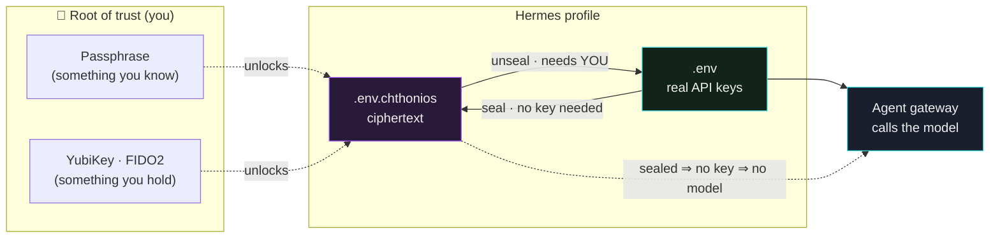
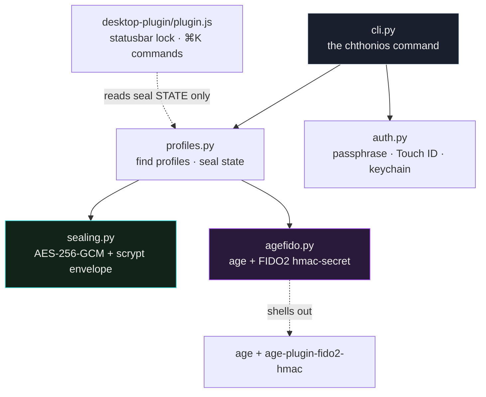

<div align="center">


# Hermes Chthonios

**Seal a Hermes agent profile at rest — until you unlock it, the profile cannot read a single API key, so it cannot call any model.**

[](https://github.com/iacker/hermes-chthonios/actions/workflows/ci.yml)
[](LICENSE)
[](https://www.python.org/)
[](pyproject.toml)
[](#requirements)
[](#how-its-built)

</div>

---

<div align="center">


*A sealed profile's keys are ciphertext. Sealing needs no key — an agent can lock itself.
Unsealing needs **you**: a passphrase, or a YubiKey physically present + a touch.*

</div>

---

## What it is, in one breath

Chthonios (χθόνιος — *"of the underworld, sealed beneath"*) is the **encrypted
basement of Hermes**. Every Hermes agent profile keeps its credentials in a
`.env` file. Chthonios encrypts that file so it becomes unreadable ciphertext.
While a profile is *sealed*, its gateway starts, finds no API key, and **cannot
answer with any model** — until a human unlocks it.

> A UI passcode only stops someone glancing at your screen; it's trivially
> bypassed from the CLI because the secrets are still sitting there in plaintext.
> **Chthonios removes the plaintext.** There is nothing to bypass.

---

## Why you'd want this

| Without Chthonios | With Chthonios |
|---|---|
| API keys sit in plaintext `.env` files | Keys are AES-256 / age ciphertext at rest |
| Stolen laptop = stolen keys | Stolen laptop = useless ciphertext |
| A screen-lock is bypassable from a shell | Nothing to bypass — the secret is *gone* until unlocked |
| Any process can read the profile's secrets | A **human decision** (passphrase / touch) is required to unlock |
| An automated agent holds its own keys forever | An agent can **seal itself** and be unable to reopen without you |

The last row is the heart of it: **sealing needs no key, unsealing does.** An
unattended agent can close the vault on itself; only someone holding the root of
trust can open it again.

---

## How it works — the 30-second mental model



- **Seal** → the plaintext `.env` is encrypted into `.env.chthonios` and shredded.
  No passphrase or key is needed to *seal* — so automation can lock a profile it
  must never be able to reopen on its own.
- **Sealed** → the gateway finds no key. The profile is inert. *That's the guarantee.*
- **Unseal** → you provide the root of trust. In passphrase mode, your passphrase
  (optionally via Touch ID). In YubiKey mode, the hardware key **must be plugged in
  and physically touched**. The `.env` is recreated (mode `600`) for the session.
- **Lock** → drop the plaintext again, keep the seal. Re-locking is instant.

---

## Two locks, independent

| Lock | Root of trust | Mechanism |
|------|---------------|-----------|
| 🔑 **Passphrase** | Something you *know* | `.env` sealed with **AES-256-GCM**, key derived from your passphrase via **scrypt** (N=2²⁰, ~1 s/derivation). Optional **Touch ID** stores the passphrase in the macOS login keychain. |
| 🛡️ **YubiKey / FIDO2** | Something you *hold* | `.env` sealed with **`age` + FIDO2 `hmac-secret`**. Decryption requires the enrolled hardware key **physically present + a touch** (and optionally a PIN). Lose the key → the profile is inert. |

A third, cosmetic layer — the **desktop UI lock** — shows seal state and warns
when a sealed profile has been unlocked. It never decrypts anything.

---

## Quickstart

### Install

```bash
pip install -e .          # provides the `chthonios` CLI

# optional desktop lock UI:
mkdir -p ~/.hermes/desktop-plugins/chthonios
cp desktop-plugin/plugin.js ~/.hermes/desktop-plugins/chthonios/plugin.js
# then ⌘K → "Reload desktop plugins" in Hermes Desktop
```

### Mode A — passphrase (works everywhere)

```bash
chthonios seal   redteam --touchid --hint "the usual"  # encrypt .env, enroll Touch ID
chthonios status                                        # table of every profile
chthonios unseal redteam --touchid                      # decrypt for a session
chthonios lock   redteam                                # drop plaintext, keep the seal
chthonios rekey  redteam                                # change the passphrase
```

### Mode B — YubiKey (hardware-gated, strongest)

```bash
# 1. Bind your YubiKey — interactive, run in YOUR terminal (needs a touch):
chthonios enroll-key redteam        # prints the exact command to run

# 2. Seal to the key — no touch needed, encryption only:
chthonios seal redteam --fido2

# 3. Unseal later — REQUIRES the YubiKey plugged in + a touch:
chthonios unseal redteam
```

Nothing and no one — not the agent, not a thief with your Mac, not a cloned disk
— decrypts a FIDO2-sealed profile without the physical key in hand.

---

## Is it easy to plug in?

Yes. Chthonios is **additive and non-invasive**:

- It only ever touches files **inside a profile directory** (`~/.hermes/profiles/<name>/`).
  It reads `.env`, writes `.env.chthonios`, and puts them back. Nothing in Hermes
  core changes.
- **Uninstall = unseal everything and delete the package.** Your profiles are
  plain `.env` files again.
- **Zero secrets in the repo:** `.env*`, `*.chthonios`, `*.identity`, and
  `*.recipient` are git-ignored, so you can't accidentally commit a key.
- The desktop plugin is a single drop-in `plugin.js` — copy it in, reload, done.
  Don't want UI? Skip it; the CLI is the whole product.

---

## How it's built

Small, readable, dependency-light. The cryptography lives in one file with no
Hermes imports, so you can audit or reuse it on its own.



| File | Responsibility |
|------|----------------|
| `chthonios/sealing.py` | AES-GCM + scrypt envelope; file seal/unseal — **no Hermes deps** |
| `chthonios/agefido.py` | `age` + FIDO2 `hmac-secret` key source (hardware-gated mode) |
| `chthonios/profiles.py` | Hermes profile path resolution + seal state |
| `chthonios/auth.py` | passphrase prompt, Touch ID, keychain enroll/fetch |
| `chthonios/cli.py` | the `chthonios` command |
| `desktop-plugin/plugin.js` | statusbar lock chip + ⌘K commands (**reads state only**) |
| `tests/` | round-trip · wrong-passphrase · tamper detection · no-leak |

---

## Requirements

**Core (passphrase mode) — works on macOS & Linux:**

- Python **3.9+**
- [`cryptography`](https://pypi.org/project/cryptography/) ≥ 41 (installed automatically)
- Touch ID unlock is macOS-only (uses the login keychain via `security`); the
  passphrase prompt works everywhere.

**YubiKey / FIDO2 mode (optional, strongest):**

- [`age`](https://github.com/FiloSottile/age) ≥ 1.1 &nbsp;·&nbsp; `brew install age`
- [`age-plugin-fido2-hmac`](https://github.com/olastor/age-plugin-fido2-hmac) &nbsp;·&nbsp; `go install …`
- `libfido2`
- Any FIDO2 authenticator with the **`hmac-secret`** extension
  *(tested on a YubiKey Security Key C NFC, firmware 5.4.3).*

> 💡 **Back up your key.** A FIDO2 seal has no backdoor: lose the only enrolled
> key and the data is gone for good. Enroll a **second YubiKey** as a spare.

---

## Security model

- **Cipher:** AES-256-GCM — authenticated, so tampering is detected on unseal.
- **KDF:** scrypt, N=2²⁰, r=8, p=1 — ~1 s/derivation, resists brute force.
- **Root of trust:**
  - *Passphrase mode* — the passphrase. Touch ID unlocks a passphrase you chose
    to store in the login keychain, never the ciphertext key directly. Skip Touch
    ID if you want the passphrase to live only in your head.
  - *FIDO2 mode* — the hardware key's `hmac-secret`. The on-disk `.identity` file
    merely *wraps a credential* to the token; it is useless without the physical
    key. The `.recipient` (an `age1…` public key) is not secret.
- **The renderer never decrypts.** The desktop plugin reads seal *state* only and
  shells you the CLI command; passphrases and plaintext never touch JS.
- **Shredding** of the plaintext `.env` is best-effort (overwrite + unlink); on
  SSD / copy-on-write filesystems this is not forensic-grade. The **seal**, not
  the shred, is the protection.

---

<div align="center">

*Tracks upstream feature request
[NousResearch/hermes-agent#81795](https://github.com/NousResearch/hermes-agent/issues/81795).*

**MIT © iacker**

</div>
